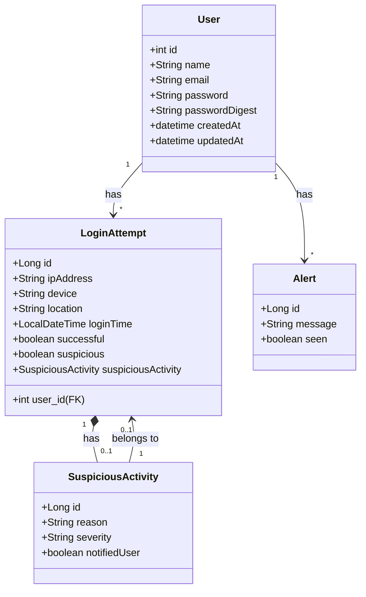

# Sistema de Autenticação Inteligente com Detecção de acesso suspeito

💡 Descrição:
Um sistema de login tradicional com autenticação por e-mail e senha, mas com um componente de IA que monitora os padrões de login dos usuários para identificar comportamentos suspeitos ou possível invasão de conta.

🛠 Funcionalidades básicas:
- Cadastro e login de usuários.
- Logs de login (IP, horário, dispositivo, localização).
- Detecção automática de comportamento atípico usando IA (ex: login de local incomum, em horário incomum, etc).
- Quando um comportamento é considerado anômalo, o sistema:
    - Envia uma notificação ao usuário.

### Diagrama de classes
